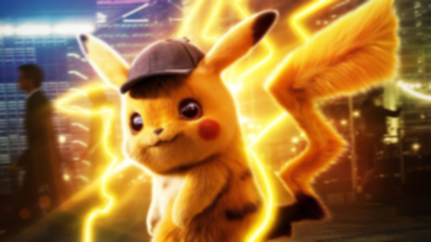
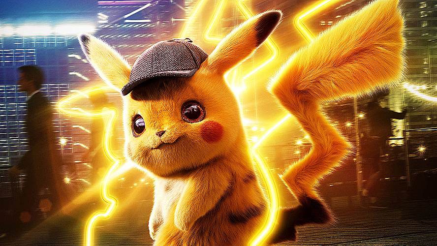
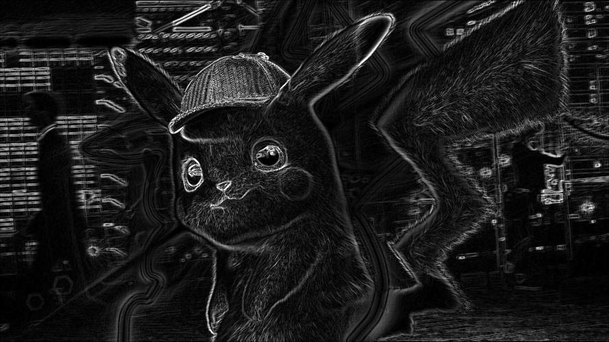
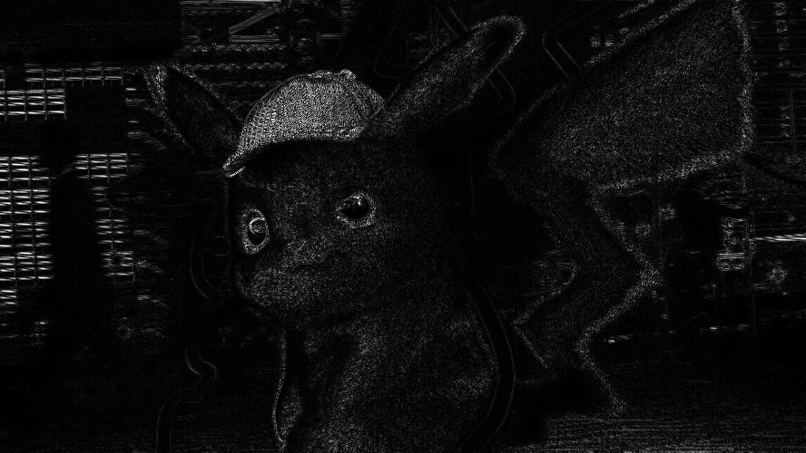
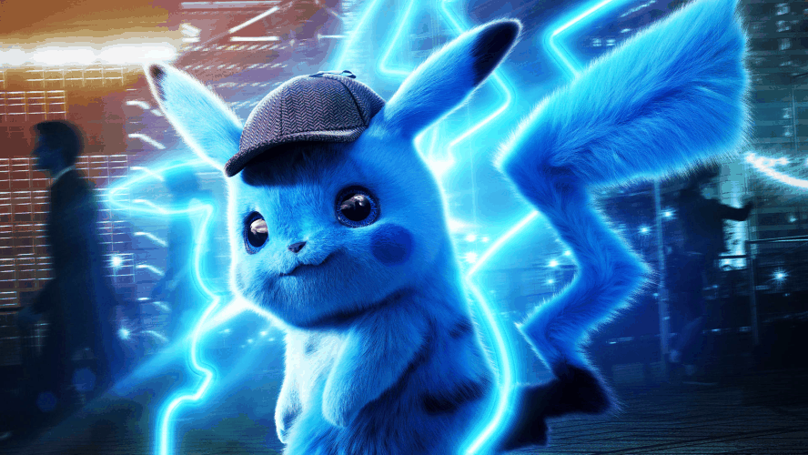
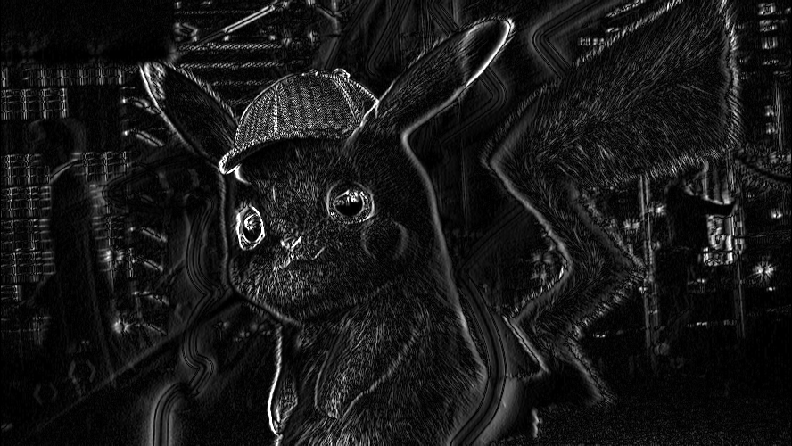

# 🧪 Taller - Ojos Digitales: Introducción a la Visión Artificial

## 📅 Fecha
`2025-05-07` – Fecha de realización

---

## 🎯 Objetivo del Taller

Entender los fundamentos de la percepción visual artificial a través de:
- Conversión de imágenes a escala de grises  
- Aplicación de filtros (desenfoque gaussiano, realce)  
- Detección básica de bordes con Sobel y Laplaciano  
- Generación de GIFs que ilustren cada paso  

---

## 🧠 Conceptos Aprendidos

- [x] Conversión a escala de grises  
- [x] Filtros convolucionales: blur y sharpening  
- [x] Detección de bordes con Sobel (X, Y y combinado)  
- [x] Detección de bordes con filtro Laplaciano  
- [x] Creación de GIFs animados para visualización de resultados  
- [ ] Uso de sliders en tiempo real (opcional)  

---

## 🔧 Herramientas y Entornos

- **Python**  
  - `opencv-python`  
  - `numpy`  
  - `imageio`  
- **Jupyter Notebook** / Google Colab  

---

## 📁 Estructura del Proyecto

```

2025-05-07\_taller\_ojos\_digitales/
├── python/
│   ├── sample\_image.jpg
│   ├── taller\_ojos\_digitales.ipynb
│   ├── output\_gray.png
│   ├── output\_blur.png
│   ├── output\_sharpen.png
│   ├── output\_sobel.png
│   ├── output\_laplacian.png
│   ├── anim\_gray.gif
│   ├── anim\_blur.gif
│   ├── anim\_sharpen.gif
│   ├── anim\_sobel.gif
│   └── anim\_laplacian.gif
└── README.md

````

---

## 🧪 Implementación

### 🔹 Etapas realizadas

1. **Carga y redimensionado**  
   - Se lee `sample_image.jpg` y se ajusta a altura fija de 500 px, manteniendo la relación de aspecto.  
2. **Escala de grises**  
   - Conversión con `cv2.cvtColor(..., cv2.COLOR_BGR2GRAY)`.  
3. **Desenfoque gaussiano**  
   - Aplicación de `cv2.GaussianBlur(..., (11,11), 0)`.  
4. **Realce (sharpen)**  
   - Filtro de realce con kernel `[[0,-1,0],[-1,5,-1],[0,-1,0]]`.  
5. **Detección de bordes Sobel**  
   - Cálculo de gradiente en X e Y, conversión a valores absolutos y combinación.  
6. **Detección de bordes Laplaciano**  
   - Aplicación de `cv2.Laplacian()` y conversión a escala absoluta.  
7. **Generación de GIFs**  
   - Transiciones entre original y cada resultado, más animación de los tres stages de Sobel.

### 🔹 Código relevante

```python
# Ejemplo de filtro de realce
kernel = np.array([[0, -1,  0],
                   [-1, 5, -1],
                   [0, -1,  0]])
sharpened = cv2.filter2D(resized_frame, -1, kernel)
````

---

## 📊 Resultados Visuales

### Escala de grises


### Desenfoque gaussiano



### Realce (Sharpen)



### Detección de bordes Sobel



### Detección de bordes Laplaciano



---

### GIFs animados

#### Transición a escala de grises



#### Transición a desenfoque


#### Transición a realce


#### Animación Sobel (X → Y → combinado)



#### Transición a Laplaciano


---

El código completo está disponible en el [notebook de Python](python/taller_ojos_digitales.ipynb).

---

## 💬 Reflexión Final

En este taller profundicé en cómo distintos filtros afectan la información visual y aprendí a distinguir resultados de detección de bordes con Sobel y Laplaciano.

---

## ✅ Checklist de Entrega

* [x] Carpeta `2025-05-07_taller_ojos_digitales/`
* [x] Código limpio y comentado en `taller_ojos_digitales.ipynb`
* [x] Imágenes `output_*.png` exportadas
* [x] GIFs animados `anim_*.gif` incluidos
* [x] README completo y claro