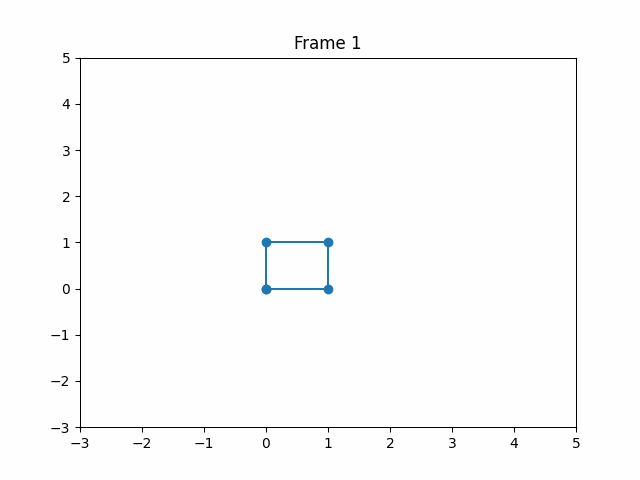

# 2D Transformation Animation

This project contains a Jupyter notebook that demonstrates how to apply geometric transformations (scaling, rotation, and translation) to a 2D figure (a square) using transformation matrices. It then generates an animated GIF showing the transformation of the figure over time.

## Tools Used

- **NumPy**: for mathematical operations and building transformation matrices.
- **Matplotlib**: for plotting the figure in each frame.
- **Imageio**: for creating a GIF from the frames.

## Process Description

1. **Initial Shape**: A square is defined using homogeneous coordinates.
2. **Transformations**:
   - **Scaling**: increases from 1 to 2.
   - **Rotation**: completes a full cycle (0 to 2π radians).
   - **Translation**: moves the figure along both x and y axes.
3. **Transformation Composition**: Matrices are combined in the order `translation @ rotation @ scale`.
4. **Frame Generation**: The transformation is applied to the square, and each frame is saved as an image.
5. **GIF Creation**: All frames are combined into an animated GIF.

## Usage

Open the file `transformaciones_2d_animadas.ipynb` in Jupyter Notebook and run the cells. Once completed, a file named `animated_transformation.gif` will be generated in the same directory, showing the animated transformation.

## Output

The result is a smooth animation of a shape that rotates, scales, and translates dynamically.

